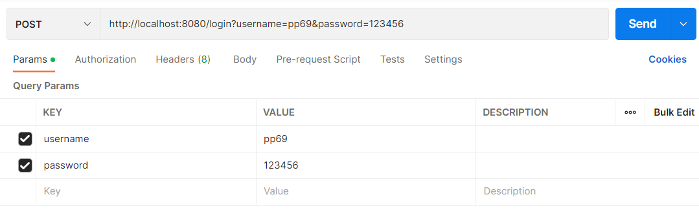
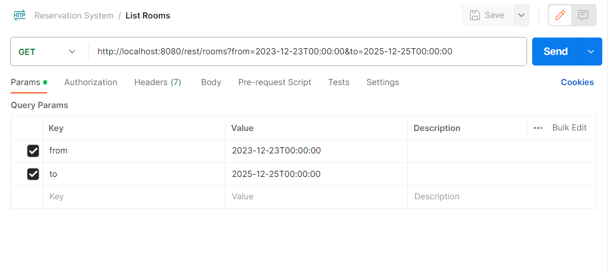

SRS: https://docs.google.com/document/d/1b8GknhXT3utM6CLW50Avw4MhZ8i7bTnvyhsfZr-q5lk/edit?usp=sharing

#### michajo6 a cechvit1

# Meeting room reservation system 

## Téma 
Systém, který  podporuje správu zasedacích místností a jejich rezervace. Podporuje také stanovení priorit
místností, tak že některé místnosti jsou zpřístupněny pouze tehdy, když nejsou žádné volné místnosti pro daný čas.

## Popis funkcionalit
Systém je určen pro studenty ČVUT, kteří jsou přihlášeni přes SSO bránu.
Umožňuje jim rezervovat si místnost v daném čase.
Místnosti můžou být různě velké a mohou být jinak vybavené. Omezením systému je, že 
uživatel si může zarezervovat místnost nejméně na jednu hodinu. 

## Seznam hlavních funkcí aplikace
#### student ČVUT
- zobrazení volných místostní pro daný den 
- vytvořit nezávaznou předrezervaci místností
- úprava předrezervace
- storno předrezervace
- potvrzení rezervace místností 
- storno rezervace (za poplatek) - netriviální

#### admin
- zobrazování  a úprava rezervací
- úprava studentů (ban)

## Cíloví uživatelé
- studenti čvut
- admin

## Cíl projektu
Zlepšní uživatelského komfortu s rezrevací místostí.

## Technické údaje
 - databáze (slon.felk.cvut.cz)
 - k dispozici je 10 místností
 - dvě role (admin, student)
 - maven 
 - spolehlivost závislá na ČVUT serverech

## Stručný návod na spuštění aplikace
    
 - Nainstalujte aplikaci do svého počítače
 - Spusťte ReservationSystemApplication.java
 - Volejte REST nejdříve pomocí loginu:
 - 
 - Dále pak volejte libovolné metody z rest rozhraní, pokud na ně máte práva
 - Například:
 - 

## Struktura aplikace

 - Aplikace je strukturovaná dle předlohy e-shopu
 - Obsahuje model, DAO, service a rest vrstvu
 - Dále obsahuje testy, potřebné DTO a jiné konfigurační soubory

## Zpětná vazba

### Josef Michálek

Vyzkoušel jsem si práci s REST rozhraním Spring Bootu. To bylo pro mě poprvé, jelikož jsem REST implementoval v jiných
jazycích a frameworcích. Obecně se mi zdá, že v eshopu bylo hodně věcí děláno manuálnně, ale později jsem zjistil, že se
dají pomocí Springu automatizovat/ulehčit. To jsem však zjistil až po implementaci. Jinak si myslím, že to byl pro mě 
přínosný projekt.

### Vít Čech

Se Spring Bootem jsem pracoval poprvé. Práce s ním mě na projektu  bavila a jsem rád, že jsem se naučil něco nového. Trochu jsem bojoval s propojením s databázi, ale to jsme dokázali vyřešit.
